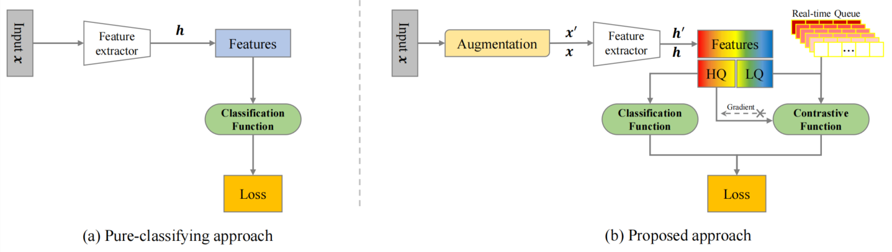

# QGFace: Quality-Guided Joint Training For Mixed-Quality Face Recognition

Official repository for QGFace: Quality-Guided Joint Training For Mixed-Quality Face Recognition



## Installation

```bash
conda create --name qgface
pip install -r requirements.txt
```

## Train

- We follow [AdaFace](https://github.com/mk-minchul/AdaFace/tree/master) to take BGR images in training and evaluation. The datasets downloaded from [ArcFace](https://github.com/deepinsight/insightface/tree/master/recognition/_datasets_) is recommended. Other training datasets could check the `ContrastDataset` in `dataset.record_dataset.py`. Other evaluation datasets could check the `ListDataset` in `validation.validation_lq.data_utils.py`.
- We take [hydra](https://hydra.cc/) to configure our project. This makes the experiments more trackable. The entrance is simple and configurable.

  > python main.py trainer.num_nodes=2
  >
- [IMPORTANT NOTICE FROM ADAFACE] Note that our implementation assumes that input to the model is `BGR` color channel as in `cv2` package. InsightFace models assume `RGB` color channel as in `PIL` package. So all our evaluation code uses `BGR` color channel with `cv2` package.

## Validation

- We take the .rec file to apply validation instead of the memfile in AdaFace.
- We incorporate IJB-B, SCface into the whole framework and make them as a regular validation dataset. It gets rid of the offline evaluation script.
- This asks for compressing them at first. To assure the order of images is the same used for accuracy calculation and compression, it should be applied on the training machine. An example of Tinyface is shown below. For SCface, as it needs identity label, a lab_func is necessary.

```
from validation.validation_lq import tinyface_helper
from dataset import convert

tinyface_image_paths = tinyface_helper.get_all_files(
    os.path.join(
        cfg.validation.tinyface.data_root,
        cfg.validation.tinyface.aligned_dir,
    )
)
lab_func = None
convert.make_rec(tinyface_image_paths, cfg.validation.tinyface.data_root, lab_func, dataset_name='tinyface', is_origin=True)
```

### Comparing with AdaFace on different Ablation

| **Setting** | **Augmentation** | **QS** | **CL** | **SCface d1** | **SCface d2** | **SCface d3** | **Tinyface** | **IJB-B** | **HQ Avg.** | **All Avg.** |
| ----------------- | ---------------------- | ------------ | ------------ | ------------------- | ------------------- | ------------------- | ------------------ | --------------- | ----------------- | ------------------ |
| Baseline          | &#9744;                | &#9744;      | &#9744;      | 61.69               | 97.23               | 99.85               | 63.98              | 90.26           | 95.62             | 84.77              |
| A                 | AdaFace                | &#9744;      | &#9744;      | 66.77               | 99.08               | **100.0**     | 67.49              | 74.07           | **95.76**   | 83.86              |
| B                 | AdaFace                | &#9745;      | &#9744;      | 68.15               | 98.46               | **100.0**     | 67.03              | 70.45           | 95.73             | 83.30              |
| C                 | AdaFace                | &#9745;      | &#9745;      | 70.92               | 98.62               | 99.69               | 66.58              | 90.59           | 95.71             | 87.02              |
| D                 | Ours                   | &#9745;      | &#9745;      | **92.31**     | **99.54**     | **100.0**     | **69.85**    | **91.05** | 95.43             | **91.36**    |

### Comparing with other resolution-invariant methods on SCface

| Method                 | d1              | d2              | d3              |
| ---------------------- | --------------- | --------------- | --------------- |
| T-C                    | 45.10           | 85.90           | 96.10           |
| FAN                    | 62.00           | 90.00           | 94.00           |
| RAN                    | 70.50           | 96.00           | 98.00           |
| FAN-FT                 | 77.50           | 95.00           | 98.30           |
| S. -C. Lai*et al.*   | 79.70           | 95.70           | 98.20           |
| RAN-FT                 | 81.30           | 97.80           | 98.80           |
| NPT-Loss               | 85.69           | 99.08           | 99.08           |
| DDL                    | 86.80           | 98.30           | 98.30           |
| S. S. Khalid*et al.* | 88.30           | 98.30           | 98.60           |
| Ours                   | **92.31** | **99.54** | **100.0** |

### Comparing with other resolution-invariant methods on Tinyface

| Method                 | Rank-1 accuracy |
| ---------------------- | --------------- |
| QualNet50-LM           | 35.54           |
| MobileFaceNet          | 48.70           |
| T-C                    | 58.60           |
| URL                    | 63.89           |
| MIND-Resnet-50-FT      | 66.82           |
| S. S. Khalid*et al.* | **70.40** |
| CurricularFace*        | 63.68           |
| AdaFace*               | 68.21           |
| AdaFace                | 63.98           |
| Ours                   | 69.85           |

## Acknowledgement

- [InsightFace](https://github.com/deepinsight/insightface/tree/master/recognition) provides datasets and the fundamental ArcFace loss.
- [AdaFace](https://github.com/mk-minchul/AdaFace/tree/master) provides elegant code and new view to incorporate image quality.
- [Paper-Writing-Tips](https://github.com/MLNLP-World/Paper-Writing-Tips) provides many tips for paper writing.

We hope more methods focusing on low-quality face recognition could open their codes and promote the development of the community.
